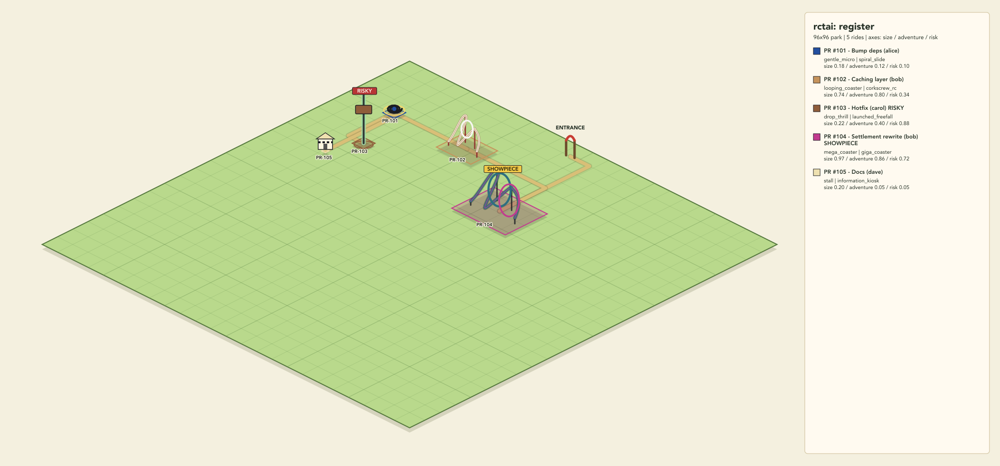

# Preview Gallery

The gallery uses preview-renderer PNGs because OpenRCT2 is not installed in this environment. In-game screenshots can be added later from real `.park` files after a manual plugin build.

## Sample Fixture



| Source | Plan | Preview |
| --- | --- | --- |
| `fixtures/sample.work-model.json` | `fixtures/sample.park-plan.json` | `gallery/sample-workflow-preview.png` |

This image came from the existing preview artifact for the committed sample workflow. It shows the fixture's five PR-shaped rides: routine cleanup, a caching feature, a risky hotfix, a showpiece rewrite, and a docs-only stall.

To regenerate the sample preview:

```sh
npm --workspace @rctai/preview run render -- \
  "$PWD/fixtures/sample.park-plan.json" \
  "$PWD/gallery/sample-workflow-preview.svg" \
  "$PWD/gallery/sample-workflow-preview.png"
```

If PNG conversion tools are unavailable:

```sh
npm --workspace @rctai/preview run render -- \
  "$PWD/fixtures/sample.park-plan.json" \
  "$PWD/gallery/sample-workflow-preview.svg"
```

## Adding Real Repository Previews

Real repository previews need a repository path, branch, and GitHub CLI access. Generate a plan first, then render it into this gallery:

```sh
mkdir -p build gallery
npm --workspace @rctai/cli run render -- \
  render /path/to/repo main \
  --out "$PWD/build/my-repo.park-plan.json" \
  --png "$PWD/gallery/my-repo-preview.png"
```

Then add a new row above with:

- source repository and branch
- generated plan path
- `gallery/<repo>-preview.png`

## Adding OpenRCT2 Screenshots

OpenRCT2 screenshots are separate from preview PNGs. Use them only after a human has loaded the plugin in OpenRCT2 and built/saved a `.park` file:

```sh
scripts/screenshot.sh build/my-repo.park --output gallery/my-repo-openrct2.png --size 1600x1200 --zoom 1
```

Set `OPENRCT2_BIN` or pass `--openrct2` if OpenRCT2 is installed outside `PATH`.
